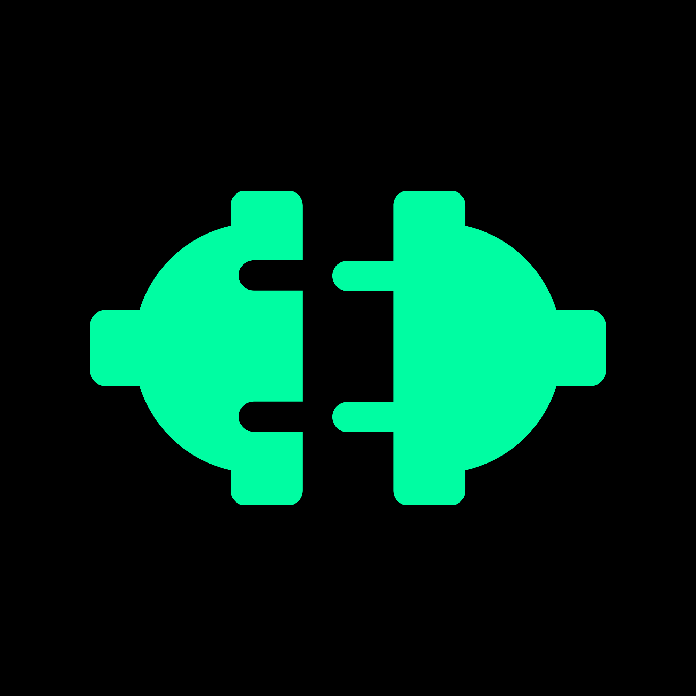

<div align="center">



# Sockit

**Zero-config LAN file sharing for your local network.**

Share files between any computers on the same Wi-Fi — no internet, no accounts, no cables.

[](https://nodejs.org)
[](https://electronjs.org)
[](https://react.dev)
[](LICENSE)

</div>

---

## What is Sockit?

Sockit is a desktop application that lets computers on the same Wi-Fi or LAN discover each other automatically and share files — similar to AirDrop, but cross-platform and open-source.

- **No internet required** — works entirely on your local network
- **No accounts or login** — just open the app and start sharing
- **No manual setup** — peers are discovered automatically via UDP broadcast
- **Cross-platform** — runs on Windows, macOS, and Linux

---

## Quick Start

### Prerequisites
- [Node.js 20+](https://nodejs.org)
- npm 9+

### Install & Run

```bash
# Clone the repository
git clone https://github.com/your-username/sockit.git
cd sockit

# Install all dependencies (client + server + electron)
npm install

# Start the app
npm run dev
```

The Electron window opens automatically. The backend server and Vite dev server start in the background.

### Exit Safely
- **Close the Electron window** — the server processes shut down automatically.
- Or press `Ctrl + C` in your terminal.

### Port Conflict? (EADDRINUSE error)
```bash
npm run kill-ports
```

---

## Configuration

Edit the `.env` file in the project root:

| Variable | Default | Description |
|---|---|---|
| `PEER_NAME` | `COMPUTERNAME` | Display name shown to other peers |
| `UDP_PORT` | `41234` | Discovery broadcast port — must match on all devices |
| `SERVER_PORT` | `4000` | Express REST API port |
| `SOCKET_PORT` | `5000` | Socket.IO real-time events port |
| `DOWNLOAD_DIR` | `server/downloads` | Where downloaded files are saved |

> **Multi-device tip:** Keep `UDP_PORT` the same on all machines. Change `PEER_NAME` so you can tell devices apart.

See [`.env.example`](.env.example) for a full template.

---

## How It Works

```
  Your Machine                        Other Machines on LAN
  ─────────────                       ─────────────────────
  Electron App
  ├── React UI  ──── Socket.IO ──────► Real-time peer & file updates
  └── Node.js Server
      ├── Express API ─────────────── ► File list sync (GET /api/files)
      │                               ► File download (GET /api/files/:id/download)
      └── UDP Discovery ─────────────► HELLO broadcasts every 3s to 255.255.255.255
```

1. **Peer Discovery** — UDP broadcasts every 3 seconds let devices find each other automatically
2. **File Sharing** — Click "Share File" or drag & drop. File metadata is registered on the LAN.
3. **Downloading** — Click download on any peer's file. Your server fetches it via HTTP and saves to your Downloads folder.
4. **Real-time UI** — Socket.IO pushes live updates whenever peers join, leave, or share files.

---

## Tech Stack

| Technology | Role |
|---|---|
| **Electron** | Desktop shell — native file dialogs, OS notifications, IPC |
| **React + Vite** | Frontend UI with real-time state |
| **Node.js** | Server runtime |
| **Express** | REST API for file sharing and download streaming |
| **Socket.IO** | Real-time push events (peer state, download progress) |
| **UDP (`dgram`)** | Peer discovery via LAN broadcast |
| **`fs` module** | Chunk-based file streaming (256 KB chunks) |

---

## Troubleshooting

**Peers not appearing?**
- Both devices must be on the same Wi-Fi/LAN
- Check that your firewall isn't blocking UDP port `41234`
- Ensure `UDP_PORT` is the same in both machines' `.env`

**Can't download files?**
- Check firewall isn't blocking TCP port `4000`
- Verify the sharing peer is still online

---

## Documentation

| Document | Description |
|---|---|
| [Architecture](docs/ARCHITECTURE.md) | How all components fit together |
| [Peer Discovery](docs/PEER_DISCOVERY.md) | UDP broadcast, HELLO/GOODBYE, stale detection |
| [File Transfer](docs/FILE_TRANSFER.md) | Pull model, HTTP streaming, chunk transfer |
| [API Reference](docs/API.md) | All REST endpoints |
| [Socket Events](docs/SOCKET_EVENTS.md) | All Socket.IO events |
| [Folder Structure](docs/FOLDER_STRUCTURE.md) | Every file explained |

---

*Made with ❤️ by Rushi*
